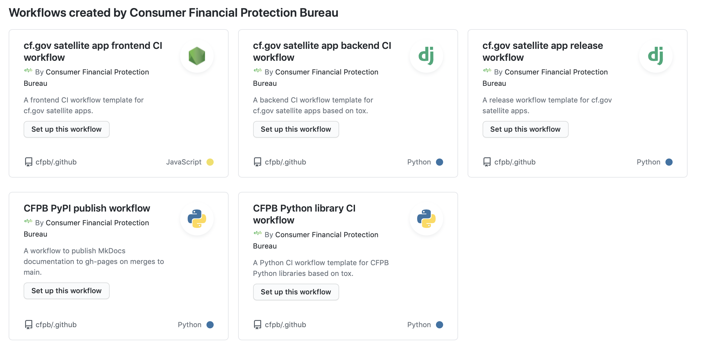
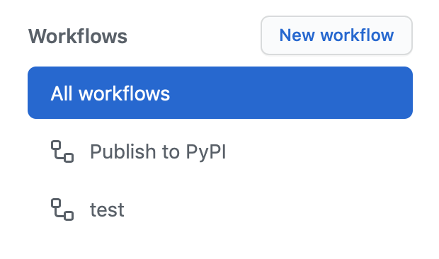

# GitHub Actions recipes

We use [GitHub Actions](https://github.com/features/actions) for some of our contionuous integration and other automations.

This guide provides some common step recipes that may be useful in custom actions. We also have a collection of common [workflow templates](https://github.com/cfpb/.github) for CI and release that make use of these steps. 

## Workflow templates

Our [workflow templates](https://github.com/cfpb/.github) provide common recipes for consumerfinance.gov-specific apps as well as our more general-purpose libraries.

To use our workflow templates, click on the "Actions" tab in a CFPB GitHub repository. If the repository does not already have a GitHub Actions workflow, you will be presented with the option of creating one from one of our templates:



If the repository already has a GitHub Actions workflow, click on the "New workflow" button at the top of the workflow list on the left. 



Then you will be presented with the option to create one from one of our templates, shown above.

New workflow templates can be created in [github.com/cfpb/.github](https://github.com/cfpb/.github) based on [GitHub's workflow template documentation](https://docs.github.com/en/actions/configuring-and-managing-workflows/sharing-workflow-templates-within-your-organization).

## Common step recipes

### Fetching git history for setuptools-git-version

Some of our consumerfinance.gov satellite apps use [setuptools-git-version](https://github.com/pyfidelity/setuptools-git-version) to set the Python package version from the latest git tag. This requires tags to be available in the checkout in the GitHub action: 

```yml
steps:
  - uses: actions/checkout@v2

  - name: Fetch tags and commits needed for setuptools-git-version
    run: |
      git fetch --depth=1 origin +refs/tags/*:refs/tags/*
      git fetch origin ${{ github.head_ref }} && git checkout ${{ github.head_ref }}
```

The intention is for the command `git describe --tags --long --dirty` to succeed. If it does not, the resulting wheel filename will contain an unpredictable string that will break our common wheel file URL patterns in requirements files.

## Attaching a Python wheel file to a GitHub release

Some of our consumerfinance.gov satellite apps have a Python wheel package file attached to their GitHub releases. We do it by outputting the wheel file name from the build step and then reading it in the upload step:

```yml
steps:
  - name: Build the Python packages
    id: build
    run: |
        python setup.py sdist bdist_wheel
        # Get the name of the .whl and .tar.gz files and set them as 
        # "outputs" of this step so we can upload them
        echo "::set-output name=bdist_wheel::$(cd dist && ls *.whl)"
        echo "::set-output name=sdist::$(cd dist && ls *.tar.gz)"

  - name: Upload the wheel
    uses: actions/upload-release-asset@v1
    env:
      GITHUB_TOKEN: ${{ secrets.GITHUB_TOKEN }}
    with:
      upload_url: ${{ github.event.release.upload_url }}
      asset_path: dist/${{ steps.build.outputs.bdist_wheel }}
      asset_name: ${{ steps.build.outputs.bdist_wheel }}
      asset_content_type: application/zip

  - name: Upload the source distribution
    uses: actions/upload-release-asset@v1
    env:
      GITHUB_TOKEN: ${{ secrets.GITHUB_TOKEN }}
    with:
      upload_url: ${{ github.event.release.upload_url }}
      asset_path: dist/${{ steps.build.outputs.sdist }}
      asset_name: ${{ steps.build.outputs.sdist }}
      asset_content_type: application/gzip
```
